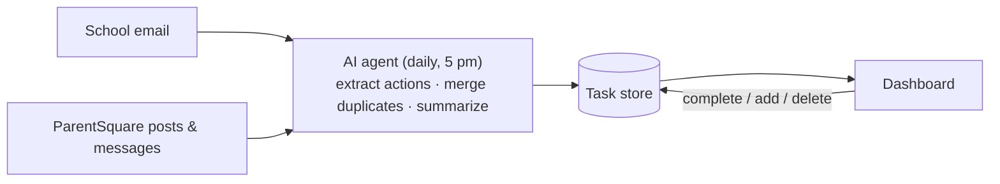

# School Tasks: turning school noise into a parent's to-do list

**[Live demo →](https://YOUR-USERNAME.github.io/school-task-dashboard/)** (runs on fictional sample data)


## The problem

Our elementary school talks to parents through two channels: ParentSquare posts and email. The same reminder often arrives three times (a post, an email copy, an evening digest), while the one thing that actually matters, like *"T-shirt sizes due by noon Thursday"*, is buried in paragraph three of a post about the lunch menu.

Nothing is missing. The information is all there. What breaks is the **translation step**: turning a stream of announcements into "what do I need to do, and by when." Every parent does that step by hand, every day.

I've spent my career on the same gap inside hospitals, where clinical information exists but doesn't turn into the next action at the bedside. This is a small, personal version of that problem, and a quick way to test how I'd design for it.

## What it does

- **Every day at 5 pm**, an AI agent reads the day's school email and ParentSquare posts.
- It **pulls out only the actions** (forms, deadlines, things to send in, events, schedule changes) and ignores newsletters and fundraising fluff.
- It **merges duplicates**: one item showing up in email and ParentSquare becomes one task tagged with both sources.
- It writes a **short daily summary** with the few things that matter most.
- The dashboard groups tasks into **Overdue / each day this week / Coming up / No date**, with direct links to the form or post.
- **Click to complete** moves a task to the Archive. Completed tasks stay archived even when the school sends another reminder.
- You can **add your own tasks**. The agent never edits or deletes them.

## Design decisions

| Decision | Why |
|---|---|
| **One task per real-world action, not per message** | Parents act on things, not messages. Duplicate merging is the core value, not a nice-to-have. |
| **5 pm run, not morning** | After school pickup is when parents plan tomorrow. The run also covers the previous evening so late posts aren't lost. |
| **Agent is read-only on the sources** | It never replies, RSVPs, pays or submits forms. Reading is low risk, acting on a family's behalf is not. Every action stays with the parent. |
| **Human edits win** | A task the parent checked off is never reopened, and parent-added tasks are off-limits to the agent. Automation should never undo a person's decision. |
| **Links to the action, not just the source** | "Submit T-shirt size" links straight to the form. The fewer clicks between seeing a task and finishing it, the more likely it gets done. |
| **No stored passwords** | The agent works inside a browser session the parent signed into once. Credentials never pass through the AI or this code. |
| **Failure is visible** | If a site logs out, the daily summary says so instead of silently showing an empty list. |

## How it works



- **Agent:** Claude, running as a scheduled task with browser access. Its full instructions are in [`agent/daily-update-prompt.md`](agent/daily-update-prompt.md). The prompt *is* the product spec: what counts as a task, how to merge, what never to touch.
- **Store:** two collections, `tasks` and `summaries` (schema below). In my personal version this lives in a Claude artifact database. In this public demo it lives in your browser's `localStorage`.
- **Dashboard:** a single HTML file with no build step and no dependencies. The same file detects where it's running and picks the right storage.

### Data model

```jsonc
// tasks/<id>
{
  "title": "Submit Fun Run T-shirt size",
  "detail": "One form per child.",
  "due": "2026-10-01",                 // or null
  "sources": ["Email", "ParentSquare"], // "Me" = added by the parent
  "links": [{ "label": "T-shirt size form", "url": "https://…" }],
  "status": "open",                     // "open" | "done"
  "completedAt": null,
  "addedOn": "2026-10-01"
}

// summaries/<YYYY-MM-DD>
{ "date": "2026-10-01", "text": "…", "highlights": ["…"] }
```

## What I learned

- **Dedup is a judgment call, not string matching.** "T-Shirt Size Needed!" and a lunch-menu post with a T-shirt reminder in the third paragraph are the same task. That's exactly what a language model is good at, and what rule-based filters miss.
- **The hard part was deciding what *not* to do.** Most of the prompt is boundaries: don't act, don't reopen, don't touch the parent's tasks, say when you couldn't read something.
- **Timing is a workflow question.** The first version ran in the morning. Moving it to 5 pm matched when planning actually happens.

## What's next

- Bus-route alerts from ParentSquare's bus groups, shown as a separate notice.
- A fully cloud-hosted version (scheduled job + IMAP + hosted DB) that doesn't depend on a desktop session.
- Multiple kids and classrooms, with a filter per child.
- Calendar export for events.

## Run the demo locally

Open `index.html` in any browser. That's it. Use **Reset sample data** to start over.

---

Built by **James Lowell**, clinical systems and product. I design workflows that turn information into action.
